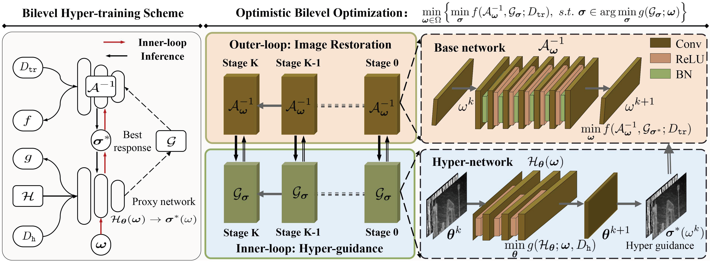
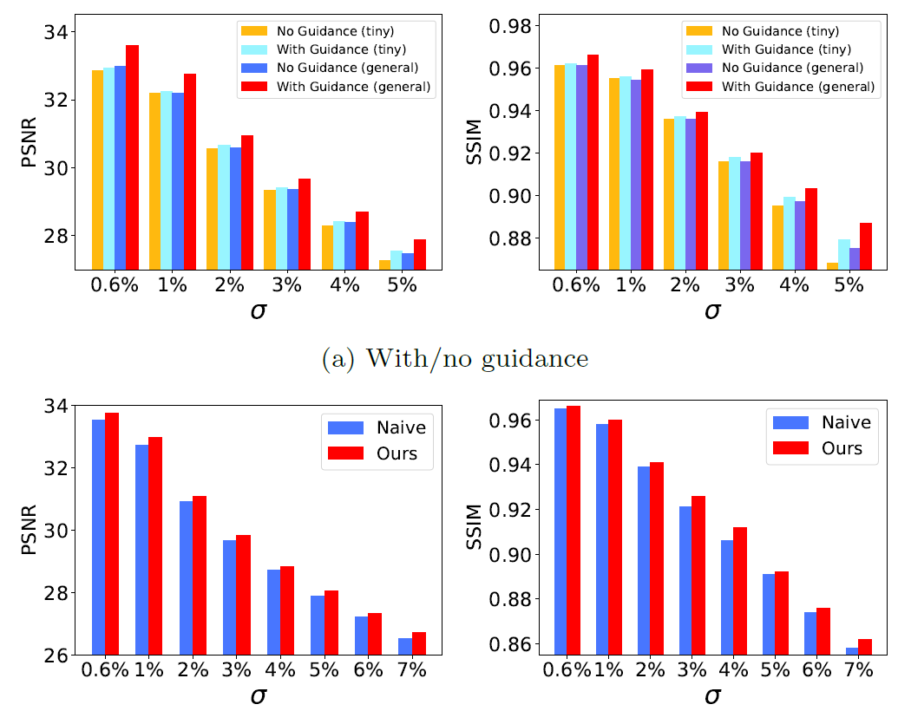
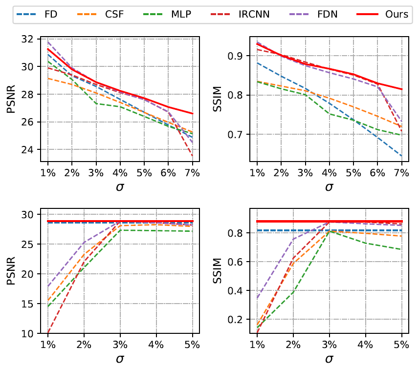
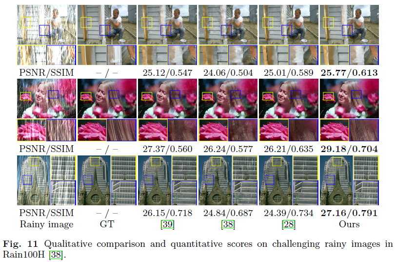
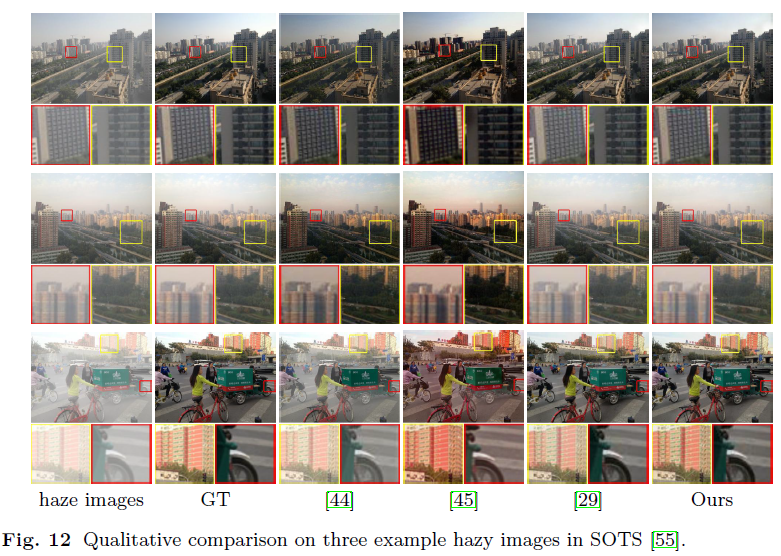

# [TVC 2023] Learning adaptive hyper-guidance via proxy-based bilevel optimization for image enhancement [[Paper]](https://link.springer.com/article/10.1007/s00371-022-02423-3)
By Jiaxin Gao, Xiaokun Liu, Risheng Liu, Xin Fan

## Abstract
In recent years, image enhancement based on deep network plays a vital role and has become the mainstream research. However, current approaches are generally limited to the manual embedding of auxiliary components (e.g., hyper-parameters, appended modules) to train the network; thus, they can often lack flexibility, adaptability, or even fail to achieve the optimal settings. Moreover, the straightforward learning-based architectures cannot adequately handle the complex latent image distributions in real-world scenarios. To partially address the above issues, in this work, a generic adaptive hyper-training scheme based on bilevel optimization is established. Specifically, we propose a completely new bilevel deep-unfolded strategy to collaboratively optimize the inner-level task-related hyper-guidance and the outer-level image reconstruction. The process can embed the differentiable proxy-based network with parameters to automatically learn the appended control mechanism. Instead of constructing the empirically manual interventions, our strategy can proactively learn to learn self-adaptive auxiliary modules. Extensive experiments demonstrate the superiority of our strategy to address different image enhancement tasks (i.e., image restoration, image rain removal and image haze removal) in terms of flexibility and effectiveness.

## Pipeline 
<p align="center">
    
</p>

## Dependencies
```
pip install -r requirements.txt
````


## How to train?
```
python main.py  
```

## How to test?
```
python test.py
```
## Model Evaluation and Analysis
- Hyper-Guidance Verication
<p align="center">
    
    
</p>


## Visual comparison
- Blind Image Restoration
<p align="center">
    
</p>

- Single Image Rain Removal
<p align="center">
    
</p>

- Single Image Haze Removal
<p align="center">
    
</p>

 

## Citation
If you use this code or ideas from the paper for your research, please cite our paper:
```
@article{gao2023learning,
  title={Learning adaptive hyper-guidance via proxy-based bilevel optimization for image enhancement},
  author={Gao, Jiaxin and Liu, Xiaokun and Liu, Risheng and Fan, Xin},
  journal={The Visual Computer},
  volume={39},
  number={4},
  pages={1471--1484},
  year={2023},
  publisher={Springer}
}
```

## Acknowledgement
Part of the code is adapted from previous works: [IRCNN](https://github.com/cszn/IRCNN) and [DPIR](https://github.com/cszn/DPIR). We thank all the authors for their contributions.

Please contact me if you have any questions at: jiaxinn.gao@outlook.com

